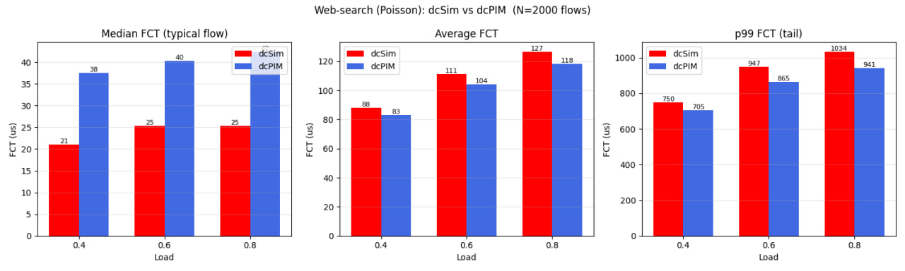

# Simulate Before Sending: Rethinking Transport in Datacenter Networks

**Team Members:**  
Valeriia Potrebina (valeriia.potrebina@mail.polimi.it);  
Alankar Gupta  (alankar.gupta@mail.polimi.it);  
Edoardo Storti (edoardo1.storti@mail.polimi.it)

---

**Source Paper:**
Dan Straussman / Technion, Israel
Isaac Keslassy / Technion, Israel & UC Berkeley, USA
Alexander Shpiner / Nvidia
Liran Liss / Nvidia

**Project:**
a link to repository in which we have a reproducible version of the
experiments we did 

https://github.com/ValeryPotrebina/dcsim-project

---

# 1. Introduction
The paper we choose adresses the behaviour of AI training comunications in datacenters during model training, which have a tendency to be bursty and unpredictable, causing significant packet drop and consequently harming AI training performances in terms of both Collective Completion Time (CCT) and encreasing tails of RDMA. The aim of the research is to create a basically losseless algorithm, robust to low and variable rate flows, capable of maintaining performances when scaling, which has visibility into the network and which do not requires specilesed hardware. Algorithm avaiable before this paper failed at least one of these requirements. 
The solution proposed is to simulate the traffic sending small simulation packets (SIMs) with dedicated virtual buffers inside each node, the real packets are sended only if the simulation ack (SIM-ACK) reaches back the sender. 
The DCSIM algorithm proved to keep near zero losses while beating in CCTs the concurent algorithms and, for big networks, not degrading as mutch as them.

# 2. Selected Result
Edo
what we have in article

# 3. Environment Setup
Edo + docker

# 4. Experiment Result
Alankar

# 5. Further Exploration — dcSim vs dcPIM on non-AI (web-search) traffic

## 5.1 Motivation and setup

dcSim was designed and evaluated **exclusively for AI-training collectives** -
synchronized, large, all-to-all / permutation transfers. Its core mechanism is
the *Sim* probe: before every Data packet a 64 B probe is sent along the same
path, and Data follows only after a fixed delay `RTT_max`. This adds a *fixed
per-flow* latency. We asked whether this overhead still pays off under **general
(non-AI) datacenter traffic**, where flows are smaller and far more varied.

To test this we ran dcSim on a classic **web-search workload** (open-loop
Poisson arrivals, a heavy-tailed flow-size distribution dominated by small
flows) and compared it against **dcPIM**, the paper's main baseline. To
configure dcPIM fairly we studied its paper (Cai, Tahmasbi Arashloo, Agarwal,
*dcPIM: Near-Optimal Proactive Datacenter Transport*, SIGCOMM 2022). dcPIM is a
**proactive** transport: long flows are matched to receivers through a constant
number of request/grant/accept rounds *before* sending, while **short flows are
sent immediately without matching** - *"dcPIM is a connectionless protocol,
allowing short flows to start sending at full rate"* (§1).

**Setup.** Same network as our reproduction (Fat-Tree k = 8, 128 hosts,
800 Gbps, 9 KB jumbo frames). Both algorithms run on *identical* traffic — same
web-search flow-size CDF, same loads, same `num_flow`, and the same RNG seed
(`srand(0)`) so the generated flows are identical; only the transport differs
(`flow_type` 117 = dcSim, 116 = dcPIM). We sweep offered load **0.4 / 0.6 / 0.8**
and report per-flow Flow Completion Time (FCT) as **median, average, and p99**.
**Expectation:** since the Sim probe is a fixed per-flow cost, we expected it to
be relatively expensive for the many small web-search flows.

## 5.2 First (incorrect) comparison

Our first run gave a surprising result: dcSim appeared to *beat* dcPIM on the
median flow (≈ 25 µs vs ≈ 40 µs), with dcPIM only slightly ahead on average and
tail. This contradicts dcPIM's design (built for low short-flow latency), so we
treated it as suspicious rather than conclusive.

## 5.3 Diagnosis and fix

Inspecting dcPIM's code and paper, we found that its short-flow threshold is the
parameter `token_initial`: a flow with `size_in_pkt ≤ token_initial` is sent
immediately, otherwise it must wait to be matched (for PIM hosts this value is
scaled by the BDP). Our configuration **never set `token_initial`**, so it
defaulted to 0 → 0 × BDP = 0 → **every** flow (even single-packet ones) was
forced through the matching phase, disabling dcPIM's short-flow fast path and
inflating its median FCT.

The dcPIM paper uses *"1 BDP as short flow size threshold"* (§4.1). We therefore
set `token_initial: 1` (→ 1 × BDP = 87 packets = 1 BDP), restoring the paper's
behavior — a **one-line config change, no recompilation**.

## 5.4 Corrected comparison

After the fix, dcPIM's median FCT dropped from ≈ 40 µs to ≈ 6 µs (small flows now
transmit immediately, ≈ 1 RTT), and **dcPIM beats dcSim on all three metrics**:

| Metric (µs) | dcSim (0.4 / 0.6 / 0.8) | dcPIM (0.4 / 0.6 / 0.8) |
|---|---|---|
| Median  | 21 / 25 / 25   | 6 / 6 / 7    |
| Average | 88 / 111 / 127 | 72 / 92 / 106 |
| p99     | 750 / 947 / 1034 | 672 / 815 / 921 |

## 5.5 Interpretation

We read FCT through three lenses because web-search is heavy-tailed: the
**median** is the typical (small) flow, the **average** is pulled up by the few
very large flows, and **p99** is the tail (slowest 1 %, the metric datacenters
care about most). dcPIM is faster on all three, but its advantage is **largest on
the median (≈ 4×)** and shrinks on average and tail (≈ 10–18 %).

The reason is the nature of dcSim's overhead. The Sim probe adds a *fixed* delay
(~`RTT_max`) before every flow. For a tiny flow that would otherwise finish in
~6 µs this is a huge relative cost (≈ 4×); for a large flow it is a small
fraction of the transfer and amortizes away. Web-search is **dominated by small
flows** — exactly the regime where dcSim's fixed probe cost hurts most, while
dcPIM sends those flows immediately. This is consistent with the dcSim paper's
own observation that it loses to dcPIM on short flows below 1 BDP (their
Figure 5, 0.5 BDP).

**Caveats.** All runs use `num_flow = 2000`.

## 5.6 Conclusion

On general (non-AI) web-search traffic, **dcSim's Sim-probe overhead is not worth
it**: dcPIM achieves lower FCT across median, average, and tail, with the largest
gap on the typical small flow. dcSim's design is tuned for large AI-training
collectives, where the one-time probe amortizes over many BDP of data; 

# 6. Reproducibility Assessment of the Paper

# 7. Conclusion

# Appendix
